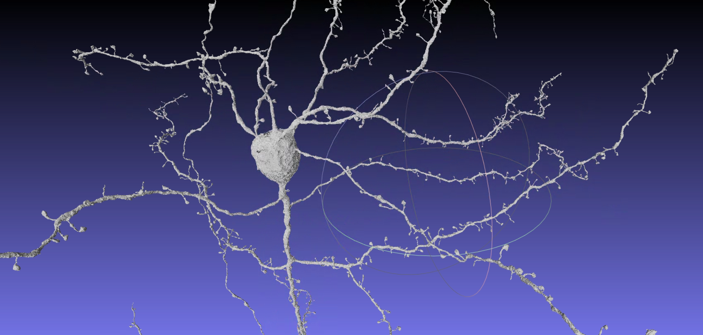
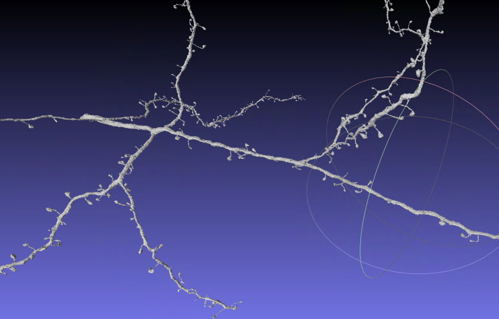
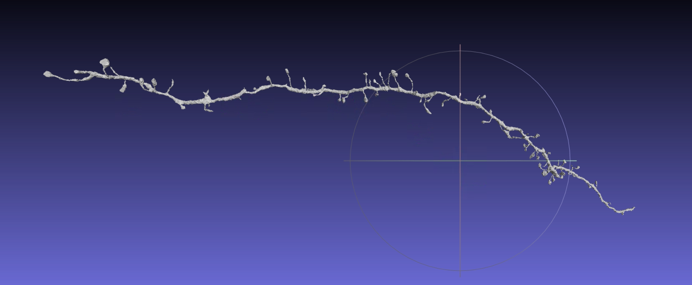
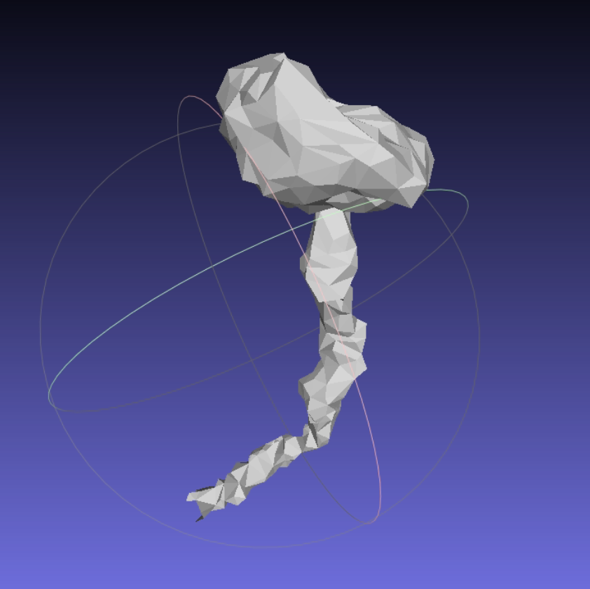

## Цифровой двойник нейрона

**Цель:** Разработка условной стохастической цифровой модели морфологии нейрона, способной генерировать биологически правдоподобные структуры, моделировать пространственную организацию дендритных шипиков и прогнозировать вероятностные изменения морфологии при изменении биологических условий. 

**Практическая значимость:** Одной из существенных проблем современных исследований нейрональной морфологии является ограниченная доступность экспериментальных данных, особенно данных о нейронах человека. Получение таких данных связано с высокой сложностью экспериментальных процедур, ограниченным доступом к биологическому материалу и невозможностью во многих случаях проводить непосредственные вмешательства с последующим наблюдением за структурными изменениями нейрона.

Разрабатываемая модель должна предоставить исследователям возможность проводить вычислительные эксперименты с искусственно сгенерированными нейрональными структурами. Предполагается, что пользователь сможет задавать исходные характеристики нейрона, на основании которых модель будет формировать правдоподобное полигональное представление его морфологии. Полученная модель нейрона должна позволять рассчитывать морфометрические и пространственные характеристики, а также моделировать воздействие внешних факторов и анализировать связанные с ними изменения структуры нейрона.

**Данные:**
* Датасет Minnie c трехмерными реконструкциями нейронов мышей, 
состояние здоровья - здоровые
* Датасет H01 c трехмерными реконструкциями нейронов людей, 
состояние здоровья - здоровые
* Датасет Labid c трехмерными реконструкциями дендритов (ветвей нейрона) мышей, состояние здоровья - здоровые / больные 

Все нейроны представлены в формате трехмерных реконструкций (полигональных сеток).

**Полигональная сетка нейрона**

**Полигональная сетка дендрита**
Дендрит – древовидный ветвящийся отросток нейрона

**Полигональная сетка части дендрита (без ветвлений)**

**Полигональная сетка дендритного шипика**
Дендритные шипики – мембранные выступы на поверхности дендрита

**Глобальная идея реализации**
Зададим математическое представление нейрона.
Пусть $𝐶$ – категориальные признаки нейрона:
- организм: человек / мышь
- наличие заболевания: здоров / наличие нейродегенерации

Сам нейрон представим как  $𝑁 = ( 𝑇, 𝑃, 𝑆 )$, 
- $𝑇$  – дендритное дерево, 
- $𝑃={𝑝_1,…,𝑝_𝑛 ​}$  – расположение шипиков на дереве, 
- $𝑆={𝑆_1 ​,…,𝑆_𝑛 ​}$ – геометрия отдельных шипиков

Тогда формула распределения нейрона при заданных категориальных признаках:
$p(T,P,S∣C)=p(T∣C)⋅p(P∣T,C)⋅∏_ip(S_i∣p_i,T,C)​$

Основными датасетами для обучения модели для генерации полигональных сеток нейронов будут датасеты Minnie и H01 (в связи с небольшим объемом датасета Labid), но в них представлены только здоровые нейроны, а наша задача получить генерации больных нейронов. Поэтому идея такая: обучить автоэнкодер на данных датасетов Minnie и H01, после этого взять датасет Labid, с помощью обученной модели перевести его в скрытое пространство признаков, посмотреть на наличие дрифта между представлениями здоровых и больных особей (в идеале в пространстве признаков должно быть выраженное отличие между дендритами здоровых и больных особей). Таким образом, мы получим модель, для которой сможем задавать слудующие параметры:
- организм: мышь или человек,
- состояние здоровья: здоровый / больной, 

на основе заданных факторов модель будет генерировать полигональную сетку дендрита, который будет статистически близок к реальному дендриту с заданными параметрами.

**Этапы:**
1) Научиться восстанавливать и генерировать отдельные части дендритов независимо от меток
2) Добавить условие **Организм** и проверить mouse/human
3) Добавить второе условие **Тип** (excitatory/inhibitory) и проверить композиционную генерацию
4) Исследовать технический сдвиг MICrONS / LabID на здоровых мышах (сдвиг, обусловленный не отличиями в морфологии дендритов, а отличиями в донорах, протоколах фиксации, электронной микроскопии, сегментации и постобработки)
5) После выравнивания технического сдвига определить морфологический сдвиг LabID healthy / LabID disease
6) Проверить нейродегенеративное преобразование внутри мышей на отложенной выборке нейронов
7) Только после успешной проверки нейродегенеративного преобразования на мышах добавить проверку на человеческих дендритах.

**Методы вылидации:**
1) Проверка автоэнкодера
Сравнение поверхностей исходного и полученного мэшей (ChamferDistance, HausdorffDistance, EarthMoverDistance), площадей поверхностей и объемов.
2) Морфометрическая валидация
Сравнение распределения метрик (объёма, площади, диаметра ствола, длины, количества шипиков, плотности шипиков, размеров шипиков и тп) для набора исходных и сгенерированных мэшей.
3) Пространственная валидация шипиков
Сравнение сетрик пространственного расположения шипиков (распределения расстояния между соседними шипиками, функцию парной корреляции и тп) для набора исходных и сгенерированных мэшей.
4) Проверка нейродегенеративного преобразования
Переводим в пространство представления здоровый дендрит из датасета Labid, который модель ранее не видела, выполняем нейродегенеративное преобразование. С помощью декодера получаем обратно мэш теперь уже больного дендрита и сравниваем его метрики с набором больных дендритов.
5) Обратное преобразование
Переводим в пространство представления больной дендрит, полученный в предыдущем тесте, выполняем обратное преобразование, декодируем мэш и сравниваем его метрики с набором здоровых дендритов.

